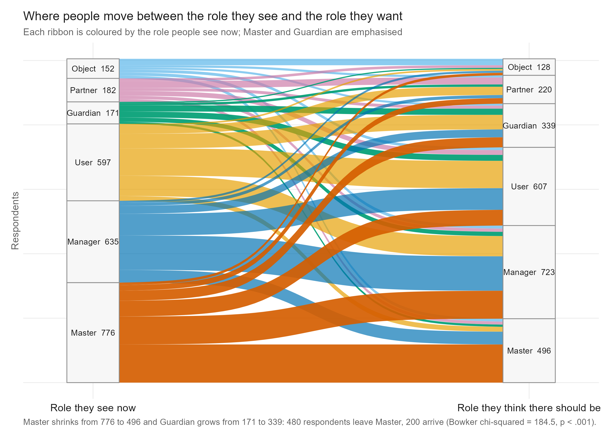
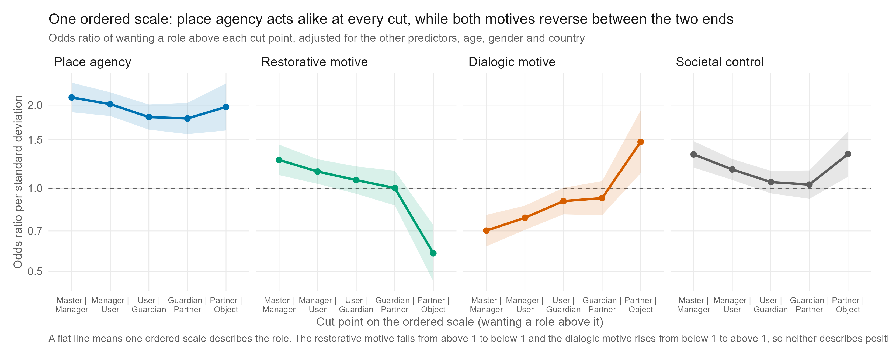
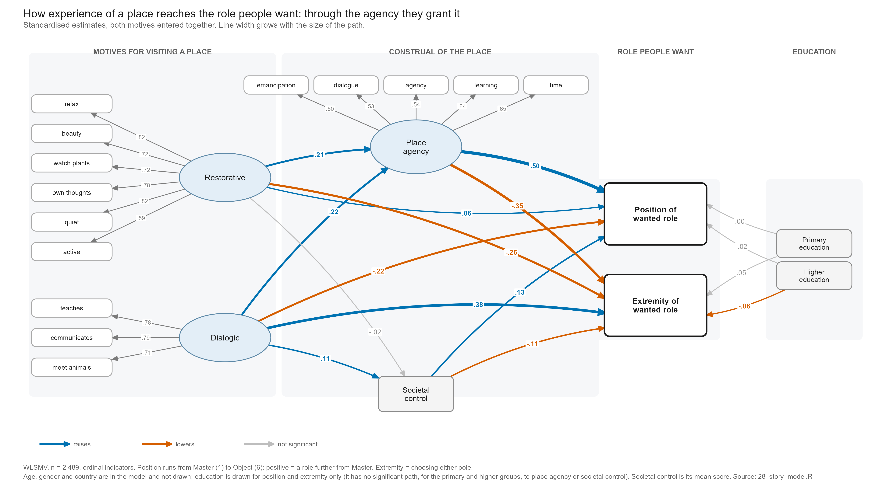

# human-nature

**Seeing mastery, wanting less: place agency and the role of humans in nature**
*(working title, Paper II)*

Analysis code for a six-country survey (Canada, Panama, Poland, the Netherlands, Spain, Sweden; n = 2,513) on how people see the human role in nature, how they want it to be, and what that wish is tied to.

> **Status:** work in progress. The analysis is exploratory, cross-sectional and was not preregistered. Every number in the working outline comes from `paperII/scripts/pipeline_log.txt`.

---

## The idea in one paragraph

People in six countries see more human *mastery* over nature than they want. The gap has a clear direction and its size differs by country. What people want is mainly one thing, how much power humans should have, and it is tied to how much independence, voice and influence a person gives to a natural place they know (**place agency**), more than to general beliefs about nature or nationality. A second dimension, how *extreme* the wanted role is, is where two kinds of visit differ: calm, restorative visits go with giving the place more independence and, through that, with a gentler role and moderate views; visits where the place feels like something to talk to (dialogic) go mainly with more extreme choices at either end.

## Main results

| | |
|---|---|
| **The gap** | 31% see *Master* as the human role now, 20% think it should be. 480 people move away from Master when asked what *should* be; 200 move toward it. Net shift −11.2 percentage points; the direction holds in five of six countries. |
| **Place agency** | The strongest link to the wanted role (Spearman ρ = +.35). The odds ratio is about 2 per standard deviation at every step of the six-role scale. Moving from low to high place agency (10th to 90th percentile) cuts the chance of wanting Master from 34% to 7.5%. |
| **Two kinds of visit** | Restorative visits go with a role further from Master mainly *through* place agency, and this route holds even when no question wording is shared. Dialogic visits mainly go with choosing either end of the scale; their link through place agency runs only through items worded like the motive itself, so it is not claimed. |
| **Who rejects mastery** | Of the people who see Master, 62% want another role. Place agency is what separates them from those who keep it (odds ratio 2.1 per standard deviation): the chance of rejecting Master rises from 40% to 84% between low and high place agency. It works in mirror for the reverse move toward Master. |
| **Seeing vs wanting** | What relates to the role people see differs from what relates to the role they want (explained variance .15 vs .25). Of 16 seen-versus-wanted comparisons, six survive a multiple-testing correction. |
| **Robustness** | The place-agency result holds across countries, question wording, random halves, response style, careless respondents and education. The restorative effect is the sensitive one. |

<p align="center">
  
  
</p>
<p align="center">
  
</p>

*Above: how the role seen moves to the role wanted (left); place agency acts alike at every step of the scale while the two motives reverse between the ends (right); the whole story as one structural model (bottom).* All 20 figures are in [`paperII/scripts/figures/`](paperII/scripts/figures/) as PNG and PDF.

## Data

Online-panel surveys in six countries, March to October 2025. The questionnaire was written in Polish, translated into English, and from English into Spanish. Measures used in the paper:

- the human role, **seen** now and **wanted** (six narratives: Master, Manager, User, Guardian, Partner, Object);
- **place agency** (five items on the respondent's own favourite natural place);
- **reasons for visiting** a place (14 items, two motives carry the paper: restorative and dialogic);
- societal control, agency of non-human beings, stances on a destroyed place, climate change, Indigenous knowledge and tourism, and demographics (education is harmonised to three levels).

**The raw data are not in this repository.** They contain IP addresses and exact timestamps, so `paperII/data/`, `*.xlsx` and `*.rds` outputs are git-ignored. A de-identified release is planned. To run the pipeline you need the six survey exports in `paperII/data/` (file names are set at the top of `01_load_and_prepare.R`).

## Run it

Requirements: **R 4.4.1** (tested); packages `readxl`, `lavaan`, `nnet`, `MASS`, `sirt`, `psych`, `GPArotation`, `ggplot2`, `ggalluvial`.

```bash
cd paperII/scripts
Rscript 00_setup.R          # installs missing packages
Rscript 00_run_pipeline.R   # runs every step, about ten minutes
```

The master script clears earlier outputs, runs the 31 steps in order and writes `pipeline_log.txt` (all printed results) and `sessionInfo.txt`. Always run the script files; inline `Rscript -e` calls can crash when reading xlsx on Windows. A full re-run reproduces the committed log line for line (apart from timings).

## Repository map

```
human-nature/
├── README.md                       this file
└── paperII/
    └── scripts/
        ├── 00_setup.R              install packages
        ├── 00_run_pipeline.R       master runner (writes the log)
        ├── 01 … 30_*.R             analysis steps (table in scripts/README.md)
        ├── sem_plot_helpers.R      small ggplot2 engine for the path diagrams
        ├── figures/                fig1 … fig20, PNG and PDF
        ├── pipeline_log.txt        every printed result of the last full run
        └── sessionInfo.txt         R and package versions
```

### Where things are

| Question | Scripts |
|---|---|
| Is there a gap between the role seen and wanted? Who moves? | `08_mastery_paradox`, `11_square_table_models`, `32_who_rejects_mastery` |
| How solid are the measures? | `12_agency_scale`, `13_reasons_efa`, `16_motive_invariance`, `18_place_relationship`, `25_motive_measurement`, `31_place_agency_facets` |
| Is the wanted role one scale? What is left over? | `24_outcome_structure` |
| What relates to seeing and to wanting? | `19_now_vs_should_sem`, `20_opposing_roles_sem`, `26_ordered_sem` |
| Do the motives act through place agency? | `21_mediation_sem`, `27_ordered_mediation`, `28_story_model` |
| Does it hold up? Countries, education, other indicators | `22_geography`, `23_robustness`, `29_education_check`, `30_indicator_connections` |
| Figures | `10_figures` (with `sem_plot_helpers.R`) |
| Supporting belief-scale work | `02`, `04`–`07`, `09` |

A one-line description of every script and its output is in [`paperII/scripts/README.md`](paperII/scripts/README.md). `03_typology_dif.R` is superseded and not run.

## Notes

- **Estimation.** Structural models use lavaan with WLSMV and ordinal indicators; the ordered outcome is analysed as position on the six-role scale plus extremity (choosing either pole).
- **Covariates.** Every model of the role adjusts for age, gender, education and country. Education answer options differ by questionnaire (9, 8 and 7 codes) and are mapped to primary, high school and higher in `04_mimic_model.R`.
- **Figures.** The path diagrams read standardised estimates straight from the fitted lavaan models and are drawn by `sem_plot_helpers.R`; nothing is typed in by hand.
- **Interpretation.** The data are cross-sectional, so "through place agency" means statistical mediation, and a reversed model fits equally well.

## Citing and licence

Please cite as: Wozniak, M. and co-authors. *Seeing mastery, wanting less: place agency and the role of humans in nature* (working title, in preparation).

No licence has been chosen yet; until one is added, all rights are reserved. Questions and comments: open an issue.
