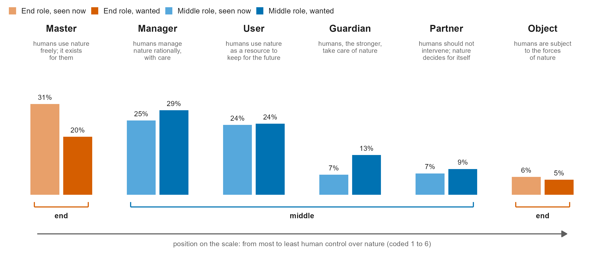
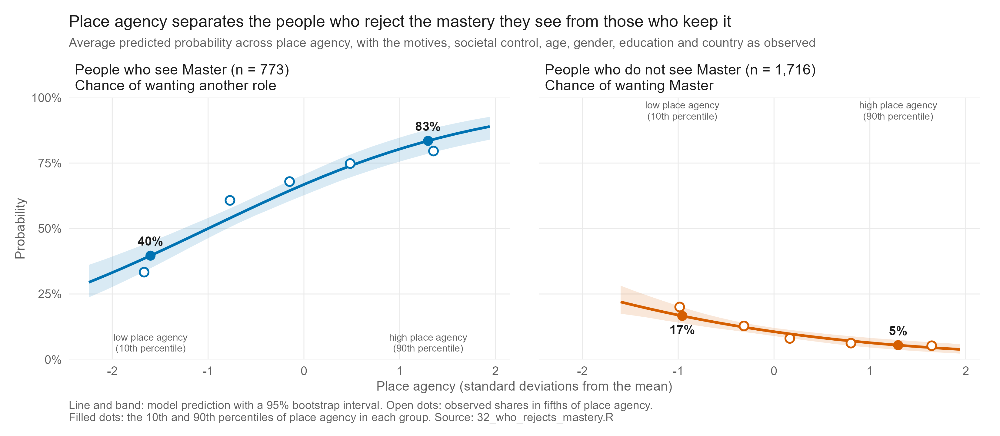

# human-nature

**Seeing Mastery, Wanting Less: Place Agency and the Role of Humans in Nature**

Analysis code for a six-country survey (Canada, Panama, Poland, the Netherlands, Spain, Sweden; N = 2,513) on the role people see for humans in nature, the role they want, and what the wanted role follows.

> **Reproducibility.** Every number in the manuscript and its supplement comes from one run of this pipeline and is printed in [`paperII/scripts/pipeline_log.txt`](paperII/scripts/pipeline_log.txt). As stated in the manuscript, the study is exploratory and was not preregistered.

---

## The idea in one paragraph

People in six countries see more human *mastery* over nature than they want. The role people see is more shared within a country; the role they want is more personal. Its closest correlate is **place agency**, the independence, voice and influence a person grants a natural place they know: it bears more on the role people want than on the role they see, and more than general beliefs about nature or the country people live in. The six roles form one scale of human dominance, with a second dimension, how far choices spread toward its two ends. Restorative visits go with moderate choices, dialogic visits with more choices at both ends.

## Main results

| | |
|---|---|
| **The gap** | 31% see *Master* as the human role now, 20% think it should be. Of the people who changed their answer, 480 moved away from Master and 200 toward it, a net shift of 11.2 percentage points; the direction holds in five of six countries. |
| **Seeing vs wanting** | The role people see is more shared, the role they want more personal. People in the same country agree more on what they see (in all six countries); personal predictors explain the wanted role about twice as well (pseudo-R² .051 vs .023); beliefs about societal control weigh more on the role seen, place agency more on the role wanted; and countries differ more in how much mastery people see than in how much they want. |
| **Who rejects mastery** | Of the people who see Master, 62% want another role. Place agency separates them from those who keep it (odds ratio 2.1 per standard deviation): the chance of rejecting Master rises from 40% to 83% between low and high place agency. The reverse move toward Master mirrors this. |
| **Place agency** | Each standard deviation doubles the odds of wanting a role further from Master (odds ratio 2.08), at every step of the six-role scale, and more strongly than for the role seen (1.58). From low to high place agency the chance of wanting Master falls from 34% to 8%. With country differences removed it correlates .35 with the wanted role; no other indicator in the questionnaire exceeds .15. |
| **Beyond general beliefs** | Place agency correlates at most .28 with the general scales (relational belief, agency of non-human beings, societal control) and the motives. Added after all of them it more than doubles the explained variation in the wanted role and accounts for 78% of what the predictors explain together. |
| **Two kinds of visit** | The wanted role has a direction (how far from Master) and a spread (how many choices fall at the two ends). Place agency moves the direction and leaves the spread unchanged. Restorative visits go with a role further from Master, mainly through place agency, and with clearly fewer choices at either end (spread ratio 0.87 per standard deviation). Dialogic visits go with more choices at both ends (spread ratio 1.06): the share choosing Master or Object rises from 21% to 30% between low and high dialogic motive. This holds when place agency is measured without the items worded like the motive (1.07). Response style does not explain these patterns. |
| **Robustness** | The place-agency result holds across countries, question wording, random halves, response style, careless respondents and education. |

<p align="center">
  
</p>
<p align="center">
  
  
</p>
<p align="center">
  
</p>
<p align="center">
  
</p>

*Above, from the top: the six roles as one scale, with the share who see and who want each role; how the role seen moves to the role wanted (left) and place agency acting alike at every step of the scale while the two motives reverse between the ends (right); who rejects the mastery they see, and who moves toward it, across place agency; the whole story as one structural model.* All 22 figures are in [`paperII/scripts/figures/`](paperII/scripts/figures/) as PNG and PDF.

## Data

Online-panel surveys in six countries, March to October 2025. The questionnaire was written in Polish, translated into English, and from English into Spanish. Measures used in the paper:

- the human role, **seen** now and **wanted** (six descriptions: Master, Manager, User, Guardian, Partner, Object);
- **place agency** (five items on the respondent's own favourite natural place);
- **reasons for visiting** a place (14 items, two motives carry the paper: restorative and dialogic);
- societal control, agency of non-human beings, stances on a destroyed place, climate change, Indigenous knowledge and tourism, and demographics (education is harmonised to three ISCED 2011 levels: primary or less, secondary, tertiary).

**The raw data are not in this repository.** They contain IP addresses and exact timestamps, so `paperII/data/`, `*.xlsx` and `*.rds` outputs are git-ignored. A de-identified data set will be released with the paper. To run the pipeline you need the six survey exports in `paperII/data/` (file names are set at the top of `01_load_and_prepare.R`).

## Run it

Requirements: **R 4.4.1** (tested); packages `readxl`, `lavaan`, `nnet`, `MASS`, `sirt`, `psych`, `GPArotation`, `ggplot2`, `ggalluvial`, `ordinal`.

```bash
cd paperII/scripts
Rscript 00_setup.R          # installs missing packages
Rscript 00_run_pipeline.R   # runs every step, about ten minutes
```

The master script clears earlier outputs, runs the 37 steps in order and writes `pipeline_log.txt` (all printed results) and `sessionInfo.txt`. Always run the script files; inline `Rscript -e` calls can crash when reading xlsx on Windows. A full re-run reproduces the committed log line for line (apart from timings).

## Repository map

```
human-nature/
├── README.md                       this file
└── paperII/
    └── scripts/
        ├── 00_setup.R              install packages
        ├── 00_run_pipeline.R       master runner (writes the log)
        ├── 01 … 38_*.R             analysis steps (table in scripts/README.md)
        ├── sem_plot_helpers.R      small ggplot2 engine for the path diagrams
        ├── figures/                fig1 … fig22, PNG and PDF
        │   └── manuscript/         the manuscript figures without built-in titles, and the graphical abstract
        ├── pipeline_log.txt        every printed result of the last full run
        └── sessionInfo.txt         R and package versions
```

### Where things are

| Question | Scripts |
|---|---|
| Is there a gap between the role seen and wanted? Who moves? | `08_mastery_paradox`, `11_square_table_models`, `32_who_rejects_mastery` |
| How solid are the measures? | `12_agency_scale`, `13_reasons_efa`, `16_motive_invariance`, `18_place_relationship`, `25_motive_measurement`, `31_place_agency_facets`, `33_incremental_validity` |
| Is the wanted role one scale? What is left over? | `24_outcome_structure`, `34_direction_and_spread` |
| What relates to seeing and to wanting? | `19_now_vs_should_sem`, `20_opposing_roles_sem`, `26_ordered_sem`, `35_shared_vs_personal` |
| Do the motives act through place agency? | `21_mediation_sem`, `27_ordered_mediation`, `28_story_model` |
| Does it hold up? Countries, education, other indicators | `22_geography`, `23_robustness`, `29_education_check`, `30_indicator_connections` |
| Who is in the samples? How do the scales behave? | `36_descriptives` |
| Exact p-values for every estimate in the supplementary tables | `37_exact_pvalues` |
| Figures | `10_figures` (with `sem_plot_helpers.R`), `38_graphical_abstract` |
| Supporting belief-scale work | `02`, `04`–`07`, `09` |

A one-line description of every script and its output is in [`paperII/scripts/README.md`](paperII/scripts/README.md). `03_typology_dif.R` is superseded and not run.

## Notes

- **Estimation.** Structural models use lavaan with WLSMV and ordinal indicators; the ordered outcome is analysed as position on the six-role scale plus extremity (choosing either end).
- **Covariates.** Every model of the role adjusts for age, gender, education and country. Education answer options differ by questionnaire (9, 8 and 7 codes) and are mapped to three ISCED 2011 levels (primary or less, secondary, tertiary) in `04_mimic_model.R`.
- **Figures.** The path diagrams read standardised estimates straight from the fitted lavaan models and are drawn by `sem_plot_helpers.R`; nothing is typed in by hand.
- **Interpretation.** The data are cross-sectional, so "through place agency" means statistical mediation.

## Citing and licence

Please cite as: Wozniak, M., Glibowska, J., & Kotus, J. *Seeing Mastery, Wanting Less: Place Agency and the Role of Humans in Nature*. Manuscript.

No licence has been chosen yet; until one is added, all rights are reserved. Questions and comments: open an issue.
